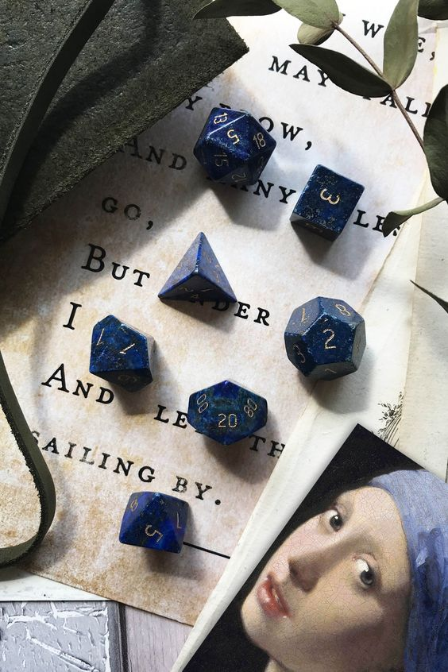

# myMeme (AKA Meme Wars)

## A personal meme repository and fun messaging tool.

- - -

### The Meme Team

 * Ariana R. - [view on GitHub](https://github.com/ReturnofVenus)
 * Kelsey G. - [view on GitHub](https://github.com/kels-gainer)
 * Kennith S. - [view on GitHub](https://github.com/KennethS13)
 * Jesse MH. - [view on GitHub](https://github.com/Gamlilorien)

 Ariana and Kelsey on the Font End team, with Kennith and Jesse on the back end with room for overlap between the two.

- - -

### App Concept
The purpose of this web app is to allow users to easily search for (and possibly create) custom memes so they can save them to their own user account for easy retrevial later. Users will have the option to easily find and send new or saved memes for potential meme combat...

- - -

### Technology Used:

  * [FireBase](https://firebase.google.com/docs/guides/?authuser=0) - for user account creation and authentication
  * [MemeGenerator API](http://version1.api.memegenerator.net/#JavaScript)
  * [node.js](https://nodejs.org/en/) - for Javascript based server code and logic
  * [express](https://expressjs.com/) - companion Web Framework for node.js
  * [mysql](https://www.npmjs.com/package/mysql) - for the ability for node to directly recieve and send data to a MySQL database.
  * [jQuery](https://jquery.com/) - for a few Javascript shortcuts
  * [bootstrap css](https://getbootstrap.com/) - for a UI and Design starting point
  * [Heroku](https://www.heroku.com/) - for app deployment and hosting
  * Custom Javascript, HTML, and CSS - for everything else!

- - -

### USER Stories/ Features

1. Ability to create and account and login

2. Ability to search for/ find memes, and by catagory or letter etc

3. Ability to create memes and post them to our database

4. Ability to save memes to the database as a favorite

5. The ability to send meme messages back and forth

6. Option to reply publicly as a turn-based messaging option.

- - -

### Notes

* Login page
* Memes page
* Post page

- - -

### Future Development*

* Option to create your own custom meme
* Option to direct message other users.
* Option to upload your own photo/ meme

